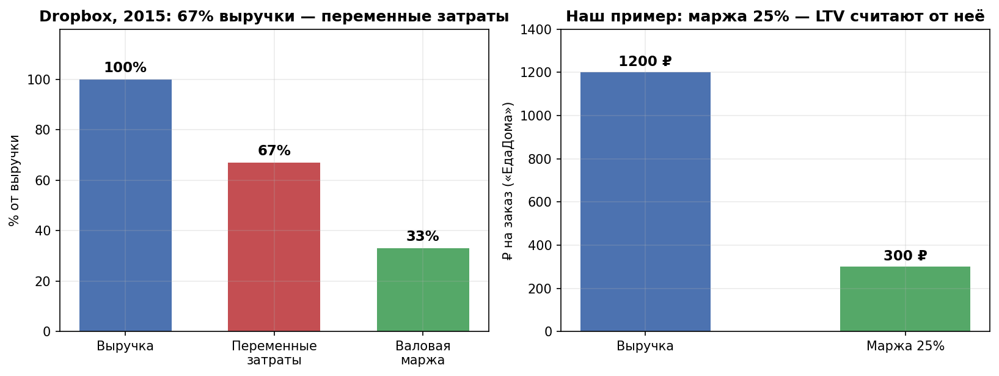
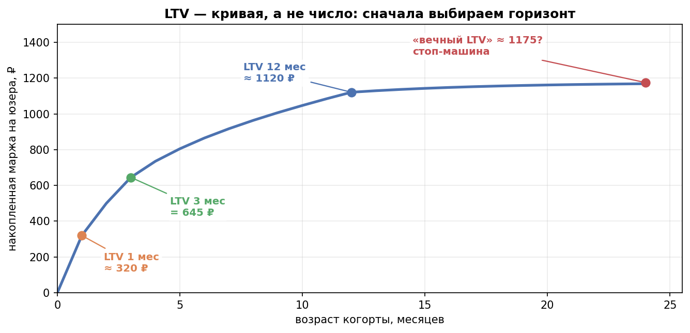
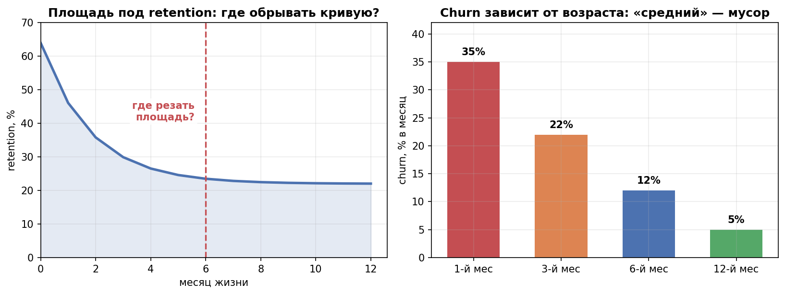
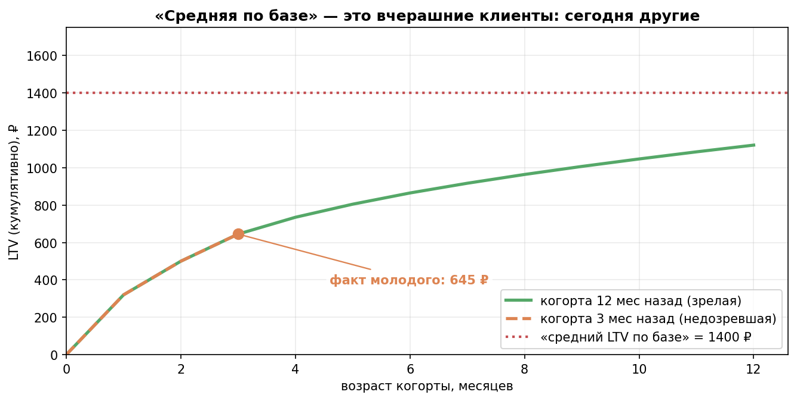
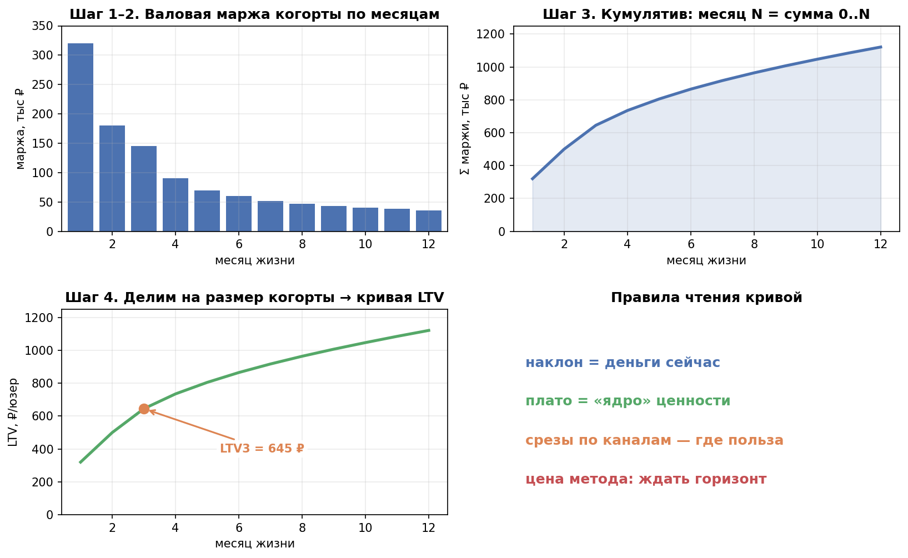
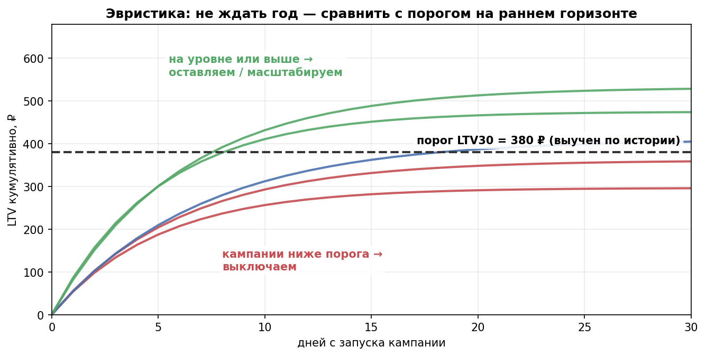
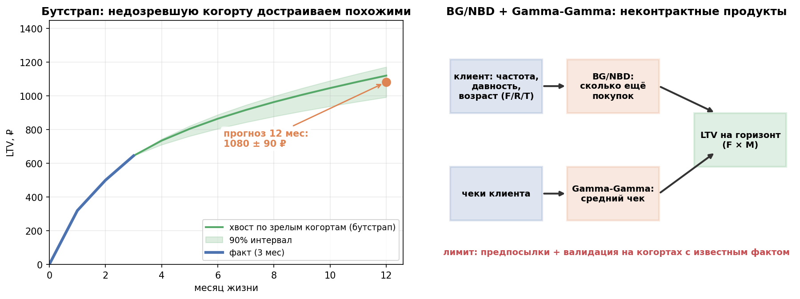
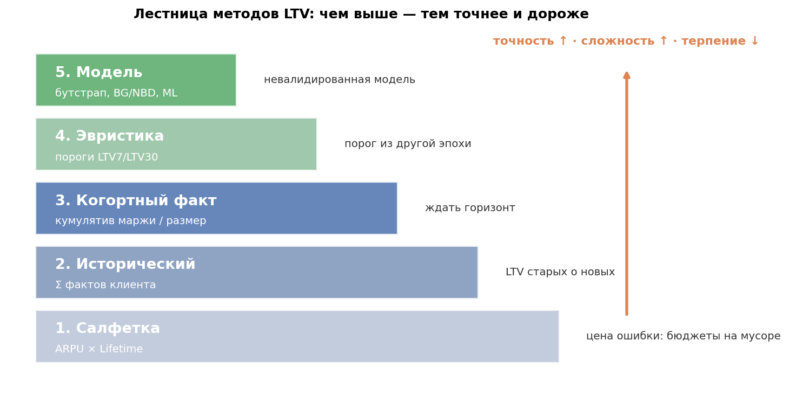
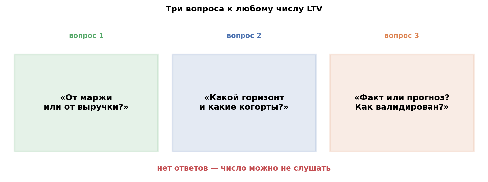

# Лекция-рассказ: как считают LTV — все способы

Спикерские заметки к уроку 2.3 (блоки = будущие слайды). Сквозной пример: доставка еды «ЕдаДома», когорта 1000 новых пользователей, средний чек 1200 ₽, маржа 25%.

> Все формулы даются отдельными блоками; в тексте — только слова и выводы. Числа в формулах и на картинках — один и тот же «канон» примера.

---

## Блок 1. Крючок: один вопрос — семь ответов

Спросите аудиторию: «Как вы считаете LTV?» Обычно слышу: «Выручка поделить на юзеров», «ARPU умножить на время жизни», «в CRM смотрим, сколько принёс клиент». Все семь человек правы — и все считают РАЗНОЕ.

LTV — это **накопленная валовая прибыль от пользователя**, а не выручка и не «сколько захотел»:

$$
LTV=\sum_{t=1}^{T}\text{маржа}_t,
\qquad
\text{маржа}=\text{выручка}-\text{переменные затраты}
$$

Общепринятой формулы нет (это признают все источники — от GoPractice до учебников): есть методы, и у каждого — свой вопрос, своя цена и свои грабли.

**Punchline слайда:** «LTV без слов "как вы его считали" — это просто число».

## Блок 2. Два решения до всякой формулы

**Решение 1 — маржа, не выручка.** Правило отбора затрат: растёт пропорционально продажам — вычитаем (закупка, доставка, комиссии, саппорт); не растёт — не трогаем (разработка, офис). Кейс GoPractice: у Dropbox в 2015-м 67% доходов съедали переменные затраты — кто считал LTV по выручке, «масштабировал» убытки. На нашем заказе это ровно 1200 ₽ выручки против 300 ₽ маржи — в 4 раза.

**Решение 2 — горизонт.** LTV — не одно число, а кривая: $LTV_7$, $LTV_3$, $LTV_{12}$ — это разные значения одной кривой. Заявляем горизонт под задачу: покупаем трафик с окупаемостью за год — считаем $LTV_{12}$. «Вечный LTV» — самый частый способ приукрасить картину.

## Блок 3. Метод 0 — салфеточный: LTV = ARPU × Lifetime

Знают все, и он же — главный источник ошибок. Ударим по нему трижды (разбор GoPractice):

$$
LTV_{\text{салфетка}}=\overline{ARPU}_{\text{марж}}\times\overline{Lifetime},
\qquad
\overline{Lifetime}=\frac{1}{\overline{churn}}
$$

1. **ARPU от выручки** — забыт пункт «маржа» (уже проходили).
2. **Lifetime — «мифический» показатель.** Три способа его добыть — и все хромают:
   - «через сколько ушёл» — юзер зашёл дважды за 30 дней и ушёл: lifetime 30 дней при двух днях реального использования;
   - «площадь под retention» — а где резать кривую? У доставки она падает и выходит в плато; у Facebook и YouTube — держится годами. Плюс ARPU первого дня ≠ ARPU двадцатого;
   - **1/Churn** — работает только при ровном оттоке. Реальный churn зависит от возраста когорты: новые отваливаются быстро, старые живут долго. «Средний churn» по смеси возрастов — мусор на входе.
3. **Когда оправдан:** порядок величины на встрече за 30 секунд — ок; решение о бюджете — нет.

**Мини-пример (наш):** маржинальный ARPU ≈ 215 ₽/мес, «средний churn» 25% в месяц:

$$
LTV\approx 215\ \frac{\text{₽}}{\text{мес}}\times\frac{1}{0{,}25}\ \text{мес}
=215\times 4\approx 860\ \text{₽}
$$

Запомним это число — ещё вернёмся.

## Блок 4. Метод 1 — исторический: сколько ПРИНЁС

Считаем по факту: сумма маржи клиента за всю наблюдаемую жизнь, в среднем по базе:

$$
LTV_{\text{истор}}=\frac{1}{N}\sum_{i=1}^{N}\sum_{t=1}^{T_i}\text{маржа}_{i,t}
\;\xrightarrow{\ \text{наша база}\ }\;1400\ \text{₽}
$$

Просто, честно для прошлого — и только для прошлого:

- молодые клиенты «недозрели» — их LTV занижен;
- средняя по базе — это старые когорты со старыми ценами и лояльностью: **LTV старых о новых** — классическое завышение;
- ответа «сколько принесёт НОВЫЙ клиент из нового канала» здесь нет вообще.

Красиво? 1400 ₽ — это про вчерашних. Завтрашних таких не будет.

## Блок 5. Метод 2 — когортный факт: золотой стандарт

Канонический алгоритм (GoPractice, 4 шага) — наш основной из урока 2.2–2.3:

1. Берём когорту (пришли в один период), считаем её валовую прибыль по периодам жизни.
2. Суммируем по когорте за каждый день/месяц.
3. Кумулятивно: месяц N = сумма месяцев 0..N.
4. Делим на размер когорты → **кривая LTV(N)** — как retention, только в деньгах:

$$
LTV_C(N)=\frac{1}{|C|}\sum_{t=1}^{N}M_t(C),
\qquad M_t(C)=\text{валовая маржа когорты } C \text{ в месяц } t
$$

Читаем кривую: наклон = деньги сейчас, плато = «ядро» ценности. Срезы по каналам — вот где начинается польза: LTV когорт блогеров vs контекста.

Цена метода: **ждать горизонт**. $LTV_{12}$ честно виден через 12 месяцев; молодые когорты — «недозревшие».

**Наш пример** (когорта 1000 чел., маржа по месяцам 320/180/145/90/… тыс ₽):

$$
LTV(3)=\frac{(320+180+145)\ \text{тыс ₽}}{1000\ \text{чел.}}=645\ \text{₽},
\qquad
LTV(12)\approx 1120\ \text{₽}
$$

Уже интереснее салфетки.

## Блок 6. Метод 3 — прогноз-эвристика: не ждать, а сравнивать с порогами

Что делают перфоманс-команды (GoPractice): не ждут год, а **калибруют пороги по истории**: «ROI/LTV 7-го дня у удачных кампаний был ≥ X, 30-го ≥ Y». С ростом бюджетов пороги уточняют по сегментам (гео, ОС, канал).

$$
\begin{cases}
LTV_{30}<380\ \text{₽} &\Rightarrow\ \text{стоп}\\[2pt]
LTV_{30}\ge 380\ \text{₽} &\Rightarrow\ \text{оставить / масштабировать}
\end{cases}
$$

Это не «расчёт LTV», а система ранней остановки — дёшево, практично, работает до всякой науки.

**Наш пример:** новая кампания дала $LTV_{30}=410\ \text{₽}\ge 380\ \text{₽}$ — оставляем и ждём уточнения.

## Блок 7. Метод 4 — прогноз-модель: бутстрап, BG/NBD, ML

Когда эвристик мало (бюджеты большие, сегментов много).

**Бутстрап хвостов:** недозревшую когорту достраиваем кривыми похожих зрелых когорт — прирост зрелой кривой масштабируем случайным коэффициентом:

$$
LTV_{12}^{\text{прогноз}}=LTV_{3}^{\text{факт}}+\bigl(LTV_{12}^{\text{зрел}}-LTV_{3}^{\text{зрел}}\bigr)\cdot k
$$

$$
LTV_{12}^{\text{прогноз}}=645+476\cdot k\approx 1080\pm 90\ \text{₽}
$$

Быстро, прозрачно, работает, когда истории много.

**Вероятностные модели покупок — BG/NBD + Gamma-Gamma** (библиотеки `lifetimes`, PyMC-Marketing): для **неконтрактных** продуктов (доставка, e-com — «ушёл» не наблюдаем, клиент просто молчит). Модель по тройке (frequency, recency, T) предсказывает ожидаемое число покупок, по чекам — средний чек, перемножаем:

$$
LTV_{H}=E\bigl[X(H)\mid F,R,T\bigr]\times E\bigl[M\bigr]
$$

Красиво в теории; на практике — предпосылки (стабильность поведения, однородность), валидация на тех когортах, где факт уже известен. **ML-регрессии** — когда фичей много (сегменты, промо, сезон), но это уже про data-команду и про осторожность.

**Сравнили четыре метода:**

| Метод | Число |
|---|---|
| Салфетка | 860 ₽ |
| Средняя по базе | 1400 ₽ |
| Когортный факт | 645 ₽ (3 мес) → 1120 ₽ (12 мес) |
| Бутстрап-прогноз | 1080 ± 90 ₽ |

Расхождения — не «ошибки», а разные вопросы.

## Блок 8. Сводная таблица (слайд-шпаргалка)

| Метод | Формула/суть | Когда | Цена ошибки |
|---|---|---|---|
| Салфетка | ARPU×Lifetime | прикидка на встрече | бюджетные решения на мусоре |
| Исторический | Σ факт-маржи клиента/базы | ретро-отчёты | LTV старых о новых |
| Когортный факт | кумулятив маржи когорты / размер | отчётность | ждать горизонт |
| Эвристика-порог | LTV7/LTV30 ≥ порога истории | ранние стопы кампаний | порог из другой эпохи/канала |
| Модель | бутстрап / BG/NBD+GG / ML | молодые когорты, scale | невалидированная модель |

## Блок 9. Финал: три вопроса к любому числу LTV

1. **«От маржи или от выручки?»** — если выручки, дальше можно не слушать.
2. **«Какой горизонт и какие когорты?»** — LTV без горизонта и без когорт — средняя температура по больнице.
3. **«Как считали: факт или прогноз?»** — прогноз обязан знать, как он валидирован.

И выход на наш курс: LTV живёт в паре с CAC,

$$
\frac{LTV}{CAC}\ge 3,
$$

а все методы — в практике 2.3, где один и тот же «ЕдаДома» посчитан всеми способами на одних данных.

---

### Вопрос аудитории на закрепление (последний слайд)

«Вам принесли презентацию: "LTV нашего сервиса = 1500 ₽, окупаем маркетинг". Ваши первые три вопроса автору?»
(Ожидаемый ответ: маржа или выручка? какой горизонт? факт или прогноз и на каких когортах — и только потом "окупаем".)

## Источники (для вас и для сносок)

- GoPractice, [Как надо и не надо считать LTV](https://gopractice.ru/product/how-to-calculate-ltv/) — маржа, когортный алгоритм, разбор ошибок ARPU×Lifetime и 1/Churn.
- Mindbox, [Гайд по LTV: сбор данных и выбор метода](https://mindbox.ru/journal/experts/ltv-sbor-dannyh-i-vybor-metoda-rascheta) — исторический vs когортный.
- PyMC-Marketing, [BG/NBD](https://www.pymc-marketing.io/en/stable/notebooks/clv/bg_nbd.html) и разборы BG/NBD + Gamma-Gamma (неконтрактные продукты, frequency/recency/T).
- Habr, [Retention, LTV и когортный анализ](https://habr.com/ru/articles/886100/) — кривая LTV, ловушки горизонтов.
- Курс: урок 2.3 + практика `practice_2_3.py` (те же четыре метода на одних данных).
